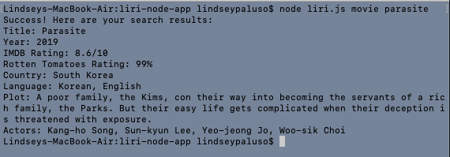

# liri-node-app

Like SIRI, but LIRI! However, while SIRI is a Speech Interpretation and Recognition Interface, LIRI is a *Language* Interpretation and Recognition Interface. LIRI is a command line node app that takes in the user input and brings back movie, concert, and song data. 

<h4><a href="https://drive.google.com/file/d/13CfB9sbPXHY9ksx831_LDQoSx_nnSWdE/view">Click for Video Demo</a></h4>

To search LIRI, enter the following commands to find information on the movie, song name, or upcoming you would like to find. The last command "do-this" brings in the movie, song, or concert data from a seperate text file.

* movie
* spotify
* concert
* do-this

How To Use:
1. Open terminal or bash.
2. Navigate to the folder where LIRI is stored on your computer.
3. Type in "node liri.js (command) (movie, song name, or artist)"

Some examples: 

Technologies LIRI incorporates:
Node, including these packages:
* axios: to make HTTP requests, request response data, format JSONs, etc.
* fs: for reading and writing to external files
* moment: puts concert date into a short, readable format
* Node Spotify API: an API library for Spotify
Javascript
